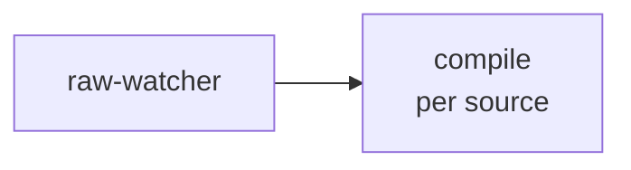
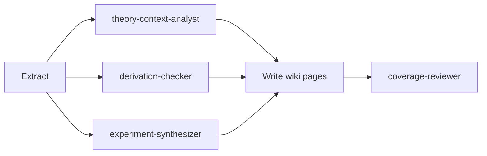

# LLM Knowledge Base


This repository contains a personal knowledge base maintained with LLM assistance, inspired by [Karpathy's LLM Wiki idea](https://x.com/karpathy/status/2039805659525644595).

![[Visualize.png]]

## Usage

Open the wiki in [Obsidian](https://obsidian.md/) and run skills via [Claude Code](https://claude.ai/code) (or Codex). Start reading from [wiki/overview.md](wiki/overview.md) or any page under `wiki/clusters/`.

### **Read the wiki**

Open `wiki/overview.md` in Obsidian. Navigate down through cluster pages → source/concept/entity pages. Use Obsidian's graph view to explore connections between pages.

### **Ask a question**

Run `/query` in Claude Code (or Codex). The skill searches the wiki starting from the relevant cluster entrance and answers without reopening raw source files. Durable answers can be archived to `wiki/analyses/`.

### **Add a new source**

1. Drop the file (PDF or Markdown) into `raw/`.
2. Choose how to ingest it:
   - **Interactive** — run `/compile`. You choose which files to process; the skill runs the analyst team, writes wiki pages, and gates on an independent coverage review, with you in the loop.
   - **Automated** — run `/sweep` (Claude Code only). Detects all new `raw/` files not yet marked `done` and runs `/compile` on each without prompting.
     - On demand: `/sweep`
     - Unattended on a schedule: `/loop 3h /sweep`

Per source, `/compile` runs: **extract → analyst team → write wiki pages → coverage review**.

**sweep**



**compile**



PDF text is extracted once with the system `python` (+ `pypdf`) into `.claude/scratch/`; analysts write findings to `.claude/scratch/findings/`. The coverage reviewer's `Ready: yes/no` verdict gates completion and fills the validation date in [raw/raw-index.md](raw/raw-index.md). Scratch files stay in place — clean them manually after a passing review.

> `/sweep` and its subagent team require Claude Code. `/compile`, `/query`, `/lint`, `/coverage-review`, and `/language` work in both Claude Code and Codex.

### **Maintain wiki health**

| Task | Skill | When to run |
| --- | --- | --- |
| Ingest (interactive) | `/compile` | When you want to choose which sources to process |
| Ingest (automated) | `/sweep` | To process all new sources hands-off |
| Ask a question | `/query` | Any time |
| Health check | `/lint` | After bulk edits or restructuring |
| Validate coverage | `/coverage-review` | After ingest, or to spot-check a source |
| Change wiki language | `/language` | When switching the repository language |

See [CLAUDE.md](CLAUDE.md) for the full orchestration spec and [rules/](rules/) for content, structure, and style rules.

### **Directory Structure**

```text
llm-knowledge-base/
├── AGENTS.md                # Codex agent entry file
├── CLAUDE.md                # Claude Code entry file
├── rules/
│   ├── README.md            # Documentation index
│   ├── repository-structure.md
│   ├── content-rules.md
│   ├── page-formats.md
│   ├── workflows.md
│   └── writing-style.md
├── .agents/
│   └── skills/              # Codex skills (compile, query, lint, coverage-review, language)
├── .claude/
│   ├── agents/              # Claude Code subagents (analyst team, compile-runner, coverage-reviewer, raw-watcher, lint-runner)
│   ├── skills/              # Claude Code skills (the above + sweep)
│   └── scratch/             # Transient PDF extractions & analyst findings (findings/); user-cleaned
├── raw/                     # Immutable source material
│   ├── raw-index.md         # Tracking table for source ingest status
│   └── assets/              # Images and attachments
└── wiki/                    # LLM-maintained wiki
    ├── log.md               # Append-only change log
    ├── overview.md          # Top-level wiki entrance
    ├── clusters/            # Topic cluster entrance pages
    ├── sources/             # Per-source summary pages
    ├── concepts/            # Abstract concept pages
    ├── entities/            # Person / tool / organization pages
    ├── comparisons/         # Comparison pages
    ├── analyses/            # Archived query results
    └── questions/           # Open questions and exploration directions
```
