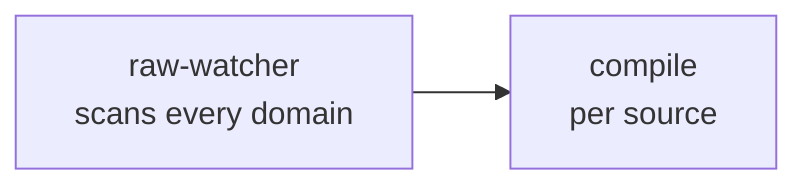
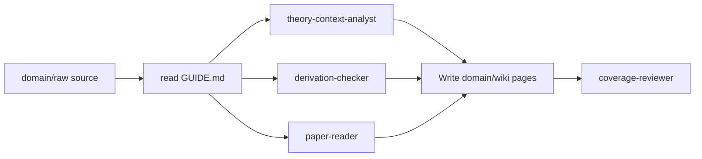

# LLM Knowledge Base

This repository contains a personal knowledge base maintained with LLM assistance, inspired by [Karpathy's LLM Wiki idea](https://x.com/karpathy/status/2039805659525644595).

## Usage

Open the repository root as a vault in [Obsidian](https://obsidian.md/) and run skills via [Claude Code](https://claude.ai/code) (or Codex). Start reading from [index.md](index.md).

The knowledge base is domain-first. Each domain is a root folder with a `GUIDE.md`, its own `raw/`, and its own `wiki/`. The first domain is [deep-learning-research](deep-learning-research/GUIDE.md).

### **Read the wiki**

Open `index.md` in Obsidian and pick a domain. Navigate down through `<domain>/wiki/overview.md` → subcluster pages → source/concept/entity pages. Use Obsidian's graph view to explore connections between pages.

### **Ask a question**

Run `/query` in Claude Code (or Codex). The skill picks the domain from `index.md`, searches that domain's wiki from its overview, and answers without reopening raw source files. Durable answers can be archived to `<domain>/wiki/analyses/`.

### **Add a new source**

1. Drop the file (PDF or Markdown) into `<domain>/raw/`, e.g. `deep-learning-research/raw/`.
2. Choose how to ingest it:
   - **Interactive** — run `/compile`. You choose which files to process; the skill runs the domain's analyst team, writes wiki pages, and gates on an independent coverage review, with you in the loop.
   - **Automated** — run `/sweep` (Claude Code only). Scans every domain for new `raw/` files not yet marked `done` and runs `/compile` on each without prompting.
     - On demand: `/sweep`
     - Unattended on a schedule: `/loop 3h /sweep`

Per source, `/compile` runs: **analyst team → write wiki pages → coverage review**. The domain's `GUIDE.md` picks the analyst team. Without an `## Analysts` section, the default team runs (theory-context-analyst, derivation-checker, experiment-synthesizer).

**sweep**

```mermaid
graph LR
    RW[raw-watcher\nscans every domain] --> C[compile\nper source]
```

**compile** (deep-learning-research team)

```mermaid
graph LR
    E[domain/raw source] --> G[read GUIDE.md]
    G --> TA[theory-context-analyst]
    G --> DC[derivation-checker]
    G --> PR[paper-reader]
    TA --> W[Write domain/wiki pages]
    DC --> W
    PR --> W
    W --> CR[coverage-reviewer]
```

Agents read PDFs directly with the Read tool (pages render via `pdftoppm`); analysts write findings to `.claude/scratch/findings/`. `paper-reader` runs the `scientific-research:paper-reading` skill; when that skill is unavailable (always on Codex), `experiment-synthesizer` runs instead. The coverage reviewer's `Ready: yes/no` verdict gates completion and fills the validation date in `<domain>/raw/raw-index.md`. Scratch files stay in place — clean them manually after a passing review.

> `/sweep` and its subagent team require Claude Code. `/compile`, `/query`, `/lint`, `/coverage-review`, and `/language` work in both Claude Code and Codex.

### **Add a new domain**

Ask the agent for a new domain. It designs the domain's `GUIDE.md` with you, creates `<domain>/raw/raw-index.md`, `<domain>/wiki/overview.md`, and `<domain>/wiki/log.md`, and adds the domain to `index.md` (`rules/content-rules.md` → Creating Subclusters and Domains).

### **Maintain wiki health**

| Task | Skill | When to run |
| --- | --- | --- |
| Ingest (interactive) | `/compile` | When you want to choose which sources to process |
| Ingest (automated) | `/sweep` | To process all new sources hands-off |
| Ask a question | `/query` | Any time |
| Health check | `/lint` | After bulk edits or restructuring |
| Validate coverage | `/coverage-review` | After ingest, or to spot-check a source |
| Change wiki language | `/language` | When switching the repository language |

See [AGENTS.md](AGENTS.md) for the orchestration spec and [rules/](rules/) for content, structure, and style rules.

### **Directory Structure**

See [rules/repository-structure.md](rules/repository-structure.md).

